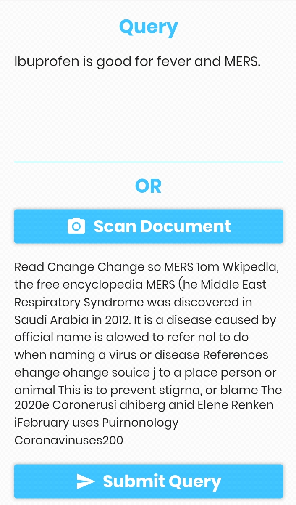

# 🏥 Medical Assistant 🏥

<div style="text-align:center;">


**_Simplify those complicated medical terms!_**

</div>

## Setup

```bash
pip install -r requirements.txt
python app.py
```

## Example Results

```
**Text**
Ibuprofen is good for all kinds of fever and pain. It has known to cure MERS symptoms.

**Result**
Ibuprofen - Ibuprofen [Chemical/Ingredient]
A nonsteroidal anti-inflammatory agent with analgesic properties used in the therapy of rheumatism and arthritis.

Fever - Body temperature above reference range (finding)
An abnormal elevation of body temperature, usually as a result of a pathologic process.

Pain - Pain [Disease/Finding]
An unpleasant sensation induced by noxious stimuli which are detected by NERVE ENDINGS of NOCICEPTIVE NEURONS.

Middle East Respiratory Syndrome - MERS
A viral disorder characterized by SARS (Severe Acute Respiratory Syndrome)-like symptoms caused by MERS-CoV (MIDDLE EAST RESPIRATORY SYNDROME CORONAVIRUS).
```

## Flutter Application 📱





&copy; 2020 Ryan Dsilva
